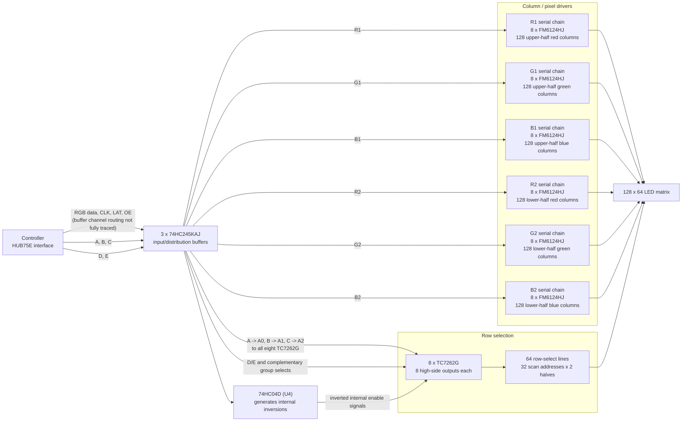

# Schemas

## Panel

This is the reverse-engineered schema of a 128x64 px panel:

```mermaid
flowchart LR
    MCU["Controller<br/>HUB75E interface"]
    BUF["3 x 74HC245KAJ<br/>input/distribution buffers"]
    INV["74HC04D (U4)<br/>generates internal inversions"]

    subgraph COL["Column / pixel drivers"]
        direction TB
        C1["R1 serial chain<br/>8 x FM6124HJ<br/>128 upper-half red columns"]
        C2["G1 serial chain<br/>8 x FM6124HJ<br/>128 upper-half green columns"]
        C3["B1 serial chain<br/>8 x FM6124HJ<br/>128 upper-half blue columns"]
        C4["R2 serial chain<br/>8 x FM6124HJ<br/>128 lower-half red columns"]
        C5["G2 serial chain<br/>8 x FM6124HJ<br/>128 lower-half green columns"]
        C6["B2 serial chain<br/>8 x FM6124HJ<br/>128 lower-half blue columns"]
    end

    subgraph ROW["Row selection"]
        direction TB
        DEC["8 x TC7262G<br/>8 high-side outputs each"]
        OUT["64 row-select lines<br/>32 scan addresses x 2 halves"]
    end

    PIX["128 x 64 LED matrix"]

    MCU -->|"RGB data, CLK, LAT, OE<br/>(buffer channel routing not fully traced)"| BUF
    BUF -->|"R1"| C1
    BUF -->|"G1"| C2
    BUF -->|"B1"| C3
    BUF -->|"R2"| C4
    BUF -->|"G2"| C5
    BUF -->|"B2"| C6
    C1 --> PIX
    C2 --> PIX
    C3 --> PIX
    C4 --> PIX
    C5 --> PIX
    C6 --> PIX

    MCU -->|"A, B, C"| BUF
    BUF -->|"A -> A0, B -> A1, C -> A2<br/>to all eight TC7262G"| DEC
    MCU -->|"D, E"| BUF
    BUF -->|"D/E and complementary group selects"| DEC
    BUF --> INV
    INV -->|"inverted internal enable signals"| DEC
    DEC --> OUT
    OUT --> PIX
```
